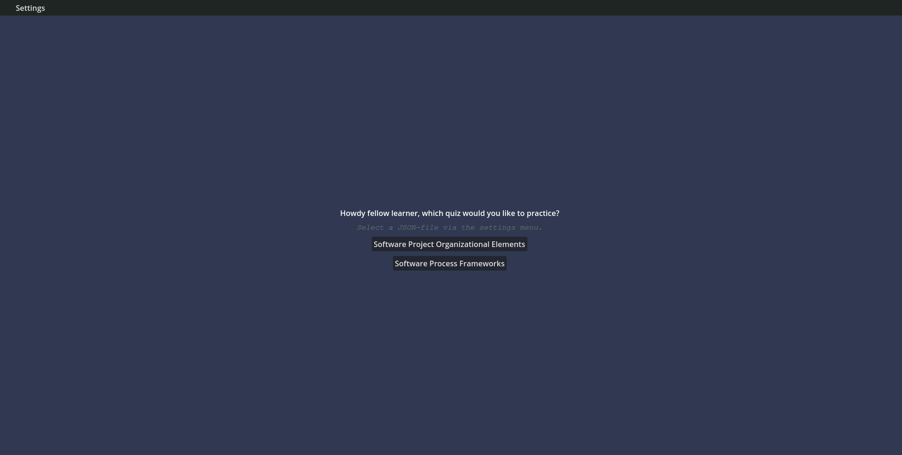
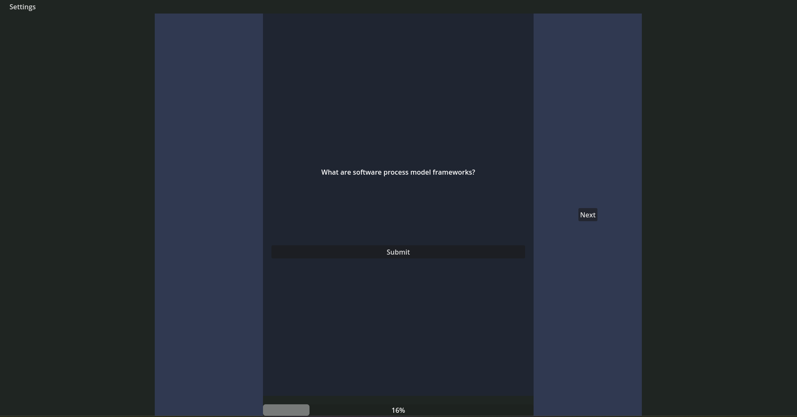
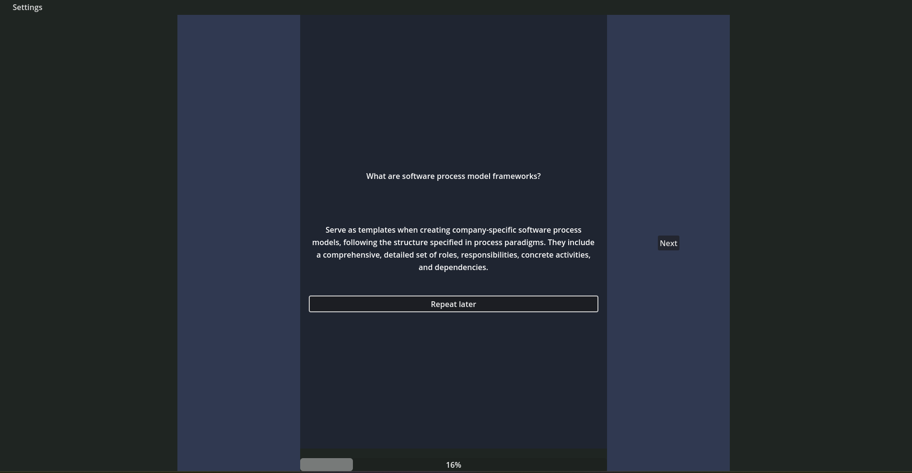
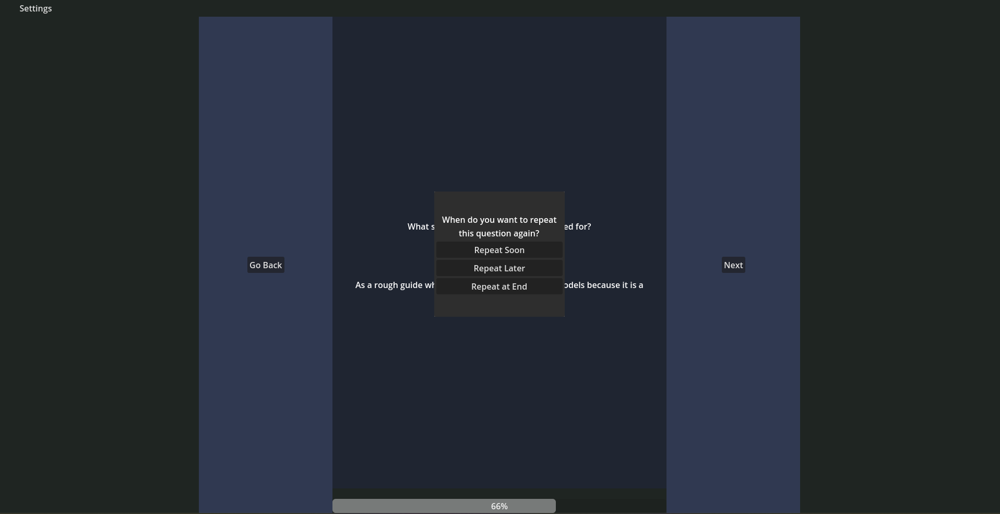
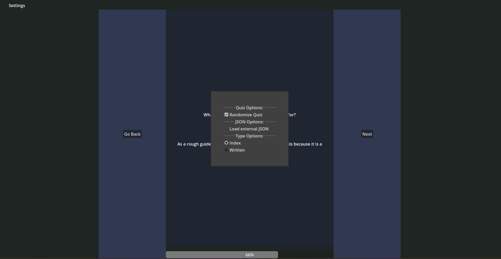

# Quiz Game with Godot

This repository contains a quiz game made with Godot Engine. The game offers various features such as different quiz modes, random question ordering, and configurable repetition of wrong answers.

## Features

- **Quiz Modes**: Choose between index mode and written answer mode.
- **JSON Import**: Load your quiz via a JSON file.
- **Random Question Order Option**: If selected, questions are shuffled randomly for each quiz run.
- **Repetition of Wrong Answers**: Choose when to repeat a wrong card during the current quiz run (soon, middle, end).

## Getting Started

### Prerequisites

- [Godot Engine](https://godotengine.org/download) (version 3.x or later)
- A JSON file containing your quiz data

### Installation

1. Clone the repository:
   ```bash
   git clone https://github.com/yourusername/quiz-game-godot.git
   ```
2. Open the project in Godot Engine.

### JSON Format

Your quiz questions should be in a JSON file.
I have attached an example quiz: [quiz.json](quiz.json).


### Usage

1. **Load Quiz**: Load your quiz data from a JSON file.
2. **Choose Mode**: Select between index mode and written answer mode.
3. **Start Quiz**: Begin the quiz with questions presented in a random order.
4. **Answer Questions**: Respond to each question. If an answer is incorrect, you can scheduled to repeat it based on your repetition choice (soon, middle, end).

### Configuration

- **Quiz Mode**: Set in the game settings.

### Screenshots


*Main Menu*


*Quiz Question Unanswered*


*Results Screen*


*Repetition Choice*


*Settings*

## Contributing

1. Fork the repository.
2. Create a new branch (`git checkout -b feature/your-feature`).
3. Make your changes and commit them (`git commit -am 'Add your feature'`).
4. Push to the branch (`git push origin feature/your-feature`).
5. Create a new Pull Request.

## License

This project is licensed under the MIT License - see the [LICENSE.md](LICENSE.md) file for details.

## Acknowledgments

- [Godot Engine](https://godotengine.org/)
- [OpenAI](https://www.openai.com/) for AI assistance

---

Feel free to open an issue if you have any questions or run into any problems!

---

